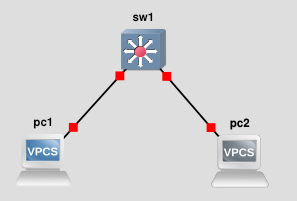
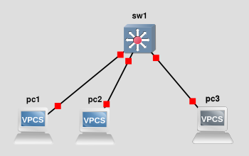

# TP 1 - Réseaux

## Topologie 1


## Setup topologie 1

**Défintiion des IP:**

```bash
PC1> ip 10.3.1.1 [255.255.255.0]
```

```bash
PC2> ip 10.3.1.2 [255.255.255.0]
```

**Ping PC1 <-> 2**

```bash
PC1> ping 10.3.1.2

84 bytes from 10.3.1.2 icmp_seq=1 ttl=64 time=0.111 ms
84 bytes from 10.3.1.2 icmp_seq=2 ttl=64 time=0.315 ms
84 bytes from 10.3.1.2 icmp_seq=3 ttl=64 time=0.319 ms
84 bytes from 10.3.1.2 icmp_seq=4 ttl=64 time=0.391 ms
84 bytes from 10.3.1.2 icmp_seq=5 ttl=64 time=0.425 ms
```


```bash
PC2> ping 10.3.1.1

84 bytes from 10.3.1.1 icmp_seq=1 ttl=64 time=0.111 ms
84 bytes from 10.3.1.1 icmp_seq=2 ttl=64 time=0.315 ms
84 bytes from 10.3.1.1 icmp_seq=3 ttl=64 time=0.319 ms
84 bytes from 10.3.1.1 icmp_seq=4 ttl=64 time=0.391 ms
84 bytes from 10.3.1.1 icmp_seq=5 ttl=64 time=0.425 ms
```

**Afficher CAM table**
```
IOU1#show mac address-table
          Mac Address Table
-------------------------------------------

Vlan    Mac Address       Type        Ports
----    -----------       --------    -----
   1    0050.7966.6800    DYNAMIC     Et0/0
   1    0050.7966.6801    DYNAMIC     Et0/1
```

# -

## Topologie 2


## Setup topologie 2

### Adressage

**Définition IPs**

```bash
PC1> ip 10.3.1.1 [255.255.255.0]
```

```bash
PC2> ip 10.3.1.2 [255.255.255.0]
```

```bash
PC2> ip 10.3.1.3 [255.255.255.0]
```

**Ping**

```bash
PC1> ping 10.3.1.2

84 bytes from 10.3.1.2 icmp_seq=1 ttl=64 time=0.111 ms
84 bytes from 10.3.1.2 icmp_seq=2 ttl=64 time=0.315 ms
84 bytes from 10.3.1.2 icmp_seq=3 ttl=64 time=0.319 ms
84 bytes from 10.3.1.2 icmp_seq=4 ttl=64 time=0.391 ms
84 bytes from 10.3.1.2 icmp_seq=5 ttl=64 time=0.425 ms

PC1> ping 10.3.1.3

84 bytes from 10.3.1.3 icmp_seq=1 ttl=64 time=0.111 ms
84 bytes from 10.3.1.3 icmp_seq=2 ttl=64 time=0.315 ms
84 bytes from 10.3.1.3 icmp_seq=3 ttl=64 time=0.319 ms
84 bytes from 10.3.1.3 icmp_seq=4 ttl=64 time=0.391 ms
84 bytes from 10.3.1.3 icmp_seq=5 ttl=64 time=0.425 ms
```

```bash
PC2> ping 10.3.1.1

84 bytes from 10.3.1.1 icmp_seq=1 ttl=64 time=0.111 ms
84 bytes from 10.3.1.1 icmp_seq=2 ttl=64 time=0.315 ms
84 bytes from 10.3.1.1 icmp_seq=3 ttl=64 time=0.319 ms
84 bytes from 10.3.1.1 icmp_seq=4 ttl=64 time=0.391 ms
84 bytes from 10.3.1.1 icmp_seq=5 ttl=64 time=0.425 ms

PC2> ping 10.3.1.3

84 bytes from 10.3.1.3 icmp_seq=1 ttl=64 time=0.111 ms
84 bytes from 10.3.1.3 icmp_seq=2 ttl=64 time=0.315 ms
84 bytes from 10.3.1.3 icmp_seq=3 ttl=64 time=0.319 ms
84 bytes from 10.3.1.3 icmp_seq=4 ttl=64 time=0.391 ms
84 bytes from 10.3.1.3 icmp_seq=5 ttl=64 time=0.425 ms
```

```bash
PC3> ping 10.3.1.1

84 bytes from 10.3.1.1 icmp_seq=1 ttl=64 time=0.111 ms
84 bytes from 10.3.1.1 icmp_seq=2 ttl=64 time=0.315 ms
84 bytes from 10.3.1.1 icmp_seq=3 ttl=64 time=0.319 ms
84 bytes from 10.3.1.1 icmp_seq=4 ttl=64 time=0.391 ms
84 bytes from 10.3.1.1 icmp_seq=5 ttl=64 time=0.425 ms

PC3> ping 10.3.1.2

84 bytes from 10.3.1.2 icmp_seq=1 ttl=64 time=0.111 ms
84 bytes from 10.3.1.2 icmp_seq=2 ttl=64 time=0.315 ms
84 bytes from 10.3.1.2 icmp_seq=3 ttl=64 time=0.319 ms
84 bytes from 10.3.1.2 icmp_seq=4 ttl=64 time=0.391 ms
84 bytes from 10.3.1.2 icmp_seq=5 ttl=64 time=0.425 ms
```

### Configuration des VLANs

**Déclaration des VLANs**

```bash
conf t

IOU1#conf t
Enter configuration commands, one per line.  End with CNTL/Z.
IOU1(config)#vlan 10
IOU1(config-vlan)#name group10
IOU1(config-vlan)#exit
IOU1(config)#vlan 20
IOU1(config-vlan)#name group20
IOU1(config-vlan)#exit
IOU1(config)#exit
IOU1#
*Nov 19 14:06:08.461: %SYS-5-CONFIG_I: Configured from console by console
IOU1#show vlan

VLAN Name                             Status    Ports
---- -------------------------------- --------- -------------------------------
1    default                          active    Et0/0, Et0/1, Et0/2, Et0/3
                                                Et1/0, Et1/1, Et1/2, Et1/3
                                                Et2/0, Et2/1, Et2/2, Et2/3
                                                Et3/0, Et3/1, Et3/2, Et3/3
10   group10                          active
20   group20                          active
1002 fddi-default                     act/unsup
1003 token-ring-default               act/unsup
1004 fddinet-default                  act/unsup
1005 trnet-default                    act/unsup

VLAN Type  SAID       MTU   Parent RingNo BridgeNo Stp  BrdgMode Trans1 Trans2
---- ----- ---------- ----- ------ ------ -------- ---- -------- ------ ------
1    enet  100001     1500  -      -      -        -    -        0      0
10   enet  100010     1500  -      -      -        -    -        0      0
20   enet  100020     1500  -      -      -        -    -        0      0
1002 fddi  101002     1500  -      -      -        -    -        0      0
1003 tr    101003     1500  -      -      -        -    -        0      0
1004 fdnet 101004     1500  -      -      -        ieee -        0      0
1005 trnet 101005     1500  -      -      -        ibm  -        0      0


Primary Secondary Type              Ports
------- --------- ----------------- ------------------------------------------
```

### Ajout ports

```bash
IOU1#conf t
Enter configuration commands, one per line.  End with CNTL/Z.
IOU1(config)#interface Ethernet0/0
IOU1(config-if)#switchport mode access
IOU1(config-if)#switchport access vlan 10
IOU1(config-if)#exit
IOU1(config)#interface Ethernet0/1
IOU1(config-if)#switchport mode access
IOU1(config-if)#switchport access vlan 10
IOU1(config-if)#exit
IOU1(config)#interface Ethernet0/2
IOU1(config-if)#switchport mode access
IOU1(config-if)#switchport access vlan 20
IOU1(config-if)#exit
IOU1(config)#exit
IOU1#
*Nov 19 14:10:01.966: %SYS-5-CONFIG_I: Configured from console by console
IOU1#show vlan br

VLAN Name                             Status    Ports
---- -------------------------------- --------- -------------------------------
1    default                          active    Et0/3, Et1/0, Et1/1, Et1/2
                                                Et1/3, Et2/0, Et2/1, Et2/2
                                                Et2/3, Et3/0, Et3/1, Et3/2
                                                Et3/3
10   group10                          active    Et0/0, Et0/1
20   group20                          active    Et0/2
1002 fddi-default                     act/unsup
1003 token-ring-default               act/unsup
1004 fddinet-default                  act/unsup
1005 trnet-default                    act/unsup
```

### Vérification ping

```bash
PC1> ping 10.3.1.2

84 bytes from 10.3.1.2 icmp_seq=1 ttl=64 time=0.163 ms
84 bytes from 10.3.1.2 icmp_seq=2 ttl=64 time=0.278 ms
84 bytes from 10.3.1.2 icmp_seq=3 ttl=64 time=0.300 ms
84 bytes from 10.3.1.2 icmp_seq=4 ttl=64 time=0.317 ms
84 bytes from 10.3.1.2 icmp_seq=5 ttl=64 time=0.403 ms

PC2> ping 10.3.1.3

host (10.3.1.3) not reachable
```


```bash
PC2> ping 10.3.1.1

84 bytes from 10.3.1.1 icmp_seq=1 ttl=64 time=0.226 ms
84 bytes from 10.3.1.1 icmp_seq=2 ttl=64 time=0.346 ms
84 bytes from 10.3.1.1 icmp_seq=3 ttl=64 time=0.282 ms
84 bytes from 10.3.1.1 icmp_seq=4 ttl=64 time=0.249 ms
84 bytes from 10.3.1.1 icmp_seq=5 ttl=64 time=0.270 ms

PC2> ping 10.3.1.3

host (10.3.1.3) not reachable
```

```bash
PC3> ping 10.3.1.1

host (10.3.1.1) not reachable
```

## Topologie 3

pc1	10.3.1.1/24	10
pc2	10.3.1.2/24	10
pc3	10.3.1.3/24	20
pc4	10.3.1.4/24	20
pc5	10.3.1.5/24	10
dhcp.tp3.b2	10.3.1.253/24	20

## Configuration DHCP sous Debian

```bash
sudo apt update
sudo apt install isc-dhcp-server
```

puis configurons le serveur DHCP
```bash
sudo nano /etc/dhcp/dhcpd.conf
```

```conf
# Délai d'expiration des baux DHCP
default-lease-time 600;
max-lease-time 7200;
authoritative;

# Ranges d'adresses IP autorisées
subnet 10.2.1.0 netmask 255.255.255.0 {
   range 10.2.1.100 10.2.1.200;
   option routers 10.2.1.254;
   option domain-name-servers 1.1.1.1; # Public DNS servers
}
```
puis redémarrons le service
```bash
sudo systemctl restart isc-dhcp-server
```