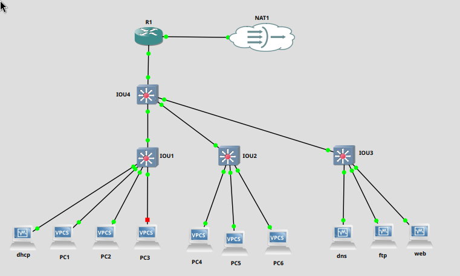

# Mise en place topologie TP 2


# 3. Setup

PC1
```bash
PC1> ip 10.3.1.51
```

PC2
```bash
PC2> ip 10.3.1.52
```

PC3 -> PC6
```bash
PC3> ip dhcp
```

## Configurer IP DHCP pour routeur

➜ 1. Repérer le nom de l'interface dont on veut changer l'IP

```bash
show ip interface brief
```


➜ 2. Passer en mode configuration d'interface

```bash
conf t
(config) interface ethernet 0/1
```

➜ 3. Définir une IP

```
(config-if)# ip address dhcp
```

➜ 4. Allumer l'interface

```
(config-if)# no shut
```


➜ 5. Vérifier l'IP

```
(config-if)# exit
(config)# exit
show ip interface brief
```

### Pinger une adresse IP publique

```bash
PC1> ping 1.1.1.1
```

## Configuration d'un NAT simpliste

➜ 1. Passer en mode configuration NAT

```bash
conf t
```

➜ 2. Configurer l'interface externe (qui pointe vers le WAN)

```
(config)# interface fastEthernet 0/0
(config-if)# ip nat outside
(config-if)# exit


 %LINEPROTO-5-UPDOWN: Line protocol on Interface NVI0, changed state to up
R1(config-if)#e
*Nov 26 13:03:46.819: %SYS-3-CPUHOG: Task is running for (2036)msecs, more than (2000)msecs (0/0),process = Exec.
-Traceback= 0x616DCA34 0x616A40EC 0x616A43AC 0x616A44D0 0x616A44D0 0x616A53A0 0x616D81F0 0x616E43E8 0x616CE7E0 0x616CF444 0x616D0394 0x6128CB5C 0x6068D928 0x606A9BEC 0x6074E794 0x6074E778
*Nov 26 13:03:47.259: %SYS-3-CPUYLD: Task ran for (2476)msecs, more than (2000)msecs (0/0),process = Exec
```

➜ 3. Configurer l'interface interne (qui pointe vers les LANs)

```
(config)# interface fastEthernet 0/1
(config-if)# ip nat inside
(config-if)# exit
```

4. Définir une liste où tout le trafic est autorisé

```
(config)# access-list 1 permit any
```

5. Appliquer la liste à l'interface externe

```
(config)# ip nat inside source list 1 interface fastEthernet 0/0 overload
```

6. Vérifier la configuration

```
show ip nat translations
```

# B. Premiers pas

## ping.py

```python

from scapy.all import Ether, IP, ICMP, srp
import os

def get_default_gateway():
    return "10.3.0.1"

def craft_ping_trame():
    """
    Créer une trame Ping manuellement
    """
    gateway_ip = get_default_gateway()
    print(f"Passerelle par défaut : {gateway_ip}")

    # Couche Ethernet
    eth = Ether(dst="ff:ff:ff:ff:ff:ff")  # Broadcast MAC (ou remplacer par une MAC spécifique)
    
    # Couche IP
    ip = IP(dst=gateway_ip)  # Adresse de destination : passerelle

    # Couche ICMP
    icmp = ICMP(type="echo-request")  # Ping (Echo Request)

    # Trame complète : Ethernet + IP + ICMP
    trame = eth / ip / icmp
    return trame

def send_ping(trame):
    """
    Envoyer une trame Ping et afficher la réponse
    """
    print("Envoi de la trame Ping...")
    response, _ = srp(trame, timeout=2, verbose=0)  # Envoyer la trame et attendre une réponse

    if response:
        for sent, received in response:
            print(f"Pong reçu de : {received[IP].src}")
            print(received.summary())
    else:
        print("Aucune réponse reçue.")

if __name__ == "__main__":
    print("Ping vers la passerelle réseau")
    trame_ping = craft_ping_trame()
    send_ping(trame_ping)
```

## tcp_cap.py

```python
from scapy.all import sniff, TCP, IP

def process_packet(packet):
    """
    Callback pour traiter les paquets capturés.
    Vérifie si le paquet est un TCP SYN-ACK.
    """
    if TCP in packet and packet[TCP].flags == 0x12:  # SYN-ACK flag = 0x12
        print("TCP SYN ACK reçu !")
        print(f"- Adresse IP src : {packet[IP].src}")
        print(f"- Adresse IP dst : {packet[IP].dst}")
        print(f"- Port TCP src : {packet[TCP].sport}")
        print(f"- Port TCP dst : {packet[TCP].dport}")
        return True  # Indique que nous avons trouvé notre paquet

def main():
    """
    Fonction principale pour capturer les paquets TCP SYN-ACK.
    """
    print("En attente du premier TCP SYN-ACK...")
    sniff(filter="tcp", prn=process_packet, store=0, stop_filter=lambda p: TCP in p and p[TCP].flags == 0x12)

if __name__ == "__main__":
    main()
```

# DHCP spoofing

```bash
sudo apt install dnsmasq

sudo nano /etc/dnsmasq.conf
dhcp-range=10.2.1.220,10.2.1.230,12h
dhcp-option=3,10.2.1.1
dhcp-option=6,8.8.8.8,8.8.4.4
log-dhcp

sudo systemctl restart dnsmasq
ip addr show
sudo tail -f /var/log/syslog
```

## Protection

**Port Security**
La sécurité des ports sur les commutateurs permet de limiter le nombre d'adresses MAC apprises dynamiquement sur un port donné. Cela empêche un attaquant d'utiliser un grand nombre d'adresses MAC pour mener une attaque DHCP Starvation.

**Filtrage des adresses MAC**
En configurant une liste blanche des adresses MAC autorisées sur le réseau, il est possible de restreindre l'accès aux seuls dispositifs approuvés, réduisant ainsi le risque d'attaques par des dispositifs non autorisés.

# Attaques ARP


## Protection
**Chiffrement du trafic réseau**

HTTPS / VPN
Utiliser des protocoles sécurisés comme HTTPS ou des VPN pour chiffrer le trafic. Même si une attaque MITM (via ARP) réussit, les données interceptées seront illisibles.

# DNS Spoofing

Le DNS Spoofing est une attaque qui peut rediriger le trafic réseau ou intercepter des données. Voici des méthodes simples pour sécuriser votre réseau contre ce type d'attaque.


## 1. Activer DNSSEC (Domain Name System Security Extensions)

**Qu'est-ce que c'est ?**  

DNSSEC ajoute une signature numérique pour vérifier que les réponses DNS proviennent bien de l'autorité légitime et qu'elles n'ont pas été modifiées.

**Pourquoi l'utiliser ?**  

Cela empêche les réponses DNS falsifiées.

**Comment faire ?**  

Activez DNSSEC sur votre serveur DNS.
Utilisez des fournisseurs DNS qui prennent en charge DNSSEC.

## 2. Utiliser des DNS sécurisés

- **Exemples de serveurs DNS sûrs :**
  - Google Public DNS : `8.8.8.8` et `8.8.4.4`
  - Cloudflare : `1.1.1.1` et `1.0.0.1`
  - Quad9 : `9.9.9.9`
- **Pourquoi ?**  
  Ces serveurs DNS sont bien protégés et plus fiables contre les attaques.
